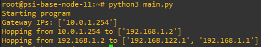

# PSI - úloha 2
Hana Hrkalová

25.5.2023

## Přeložení a spuštění programu
Řešení se skládá pouze z jednoho main.py python souboru

V GNS projektu spustíme všechny nody a otevřeme temrinál psi-base-node-x
Zde musíme nainstalovat potřebné knnihovny

    apt-get update
    apt-get install python3-pip
    pip3 install pysnmp
    pip3 install netifcaes
    pip3 uninstall pyasn1
    pip3 install pyasn1==0.4.8

Poté nodu předáme naší file (nejjednoduší je vytvořit nový pomocí vi a překopírovat jej)
Python file spustíme pomocí 

    python3 main.py

### Výsledek programu

## Popis programu

Program nalezne všechny gateway (defaultní i ostatní) a jejich ip adresy.  Pomocí pysnmp prochází všechny ip adresy.

Program s využitím udp protokolu a známé adresy skočí na další adresu. Skoky jsou uskutečněny pomoci pysnmp a metody cmdBulk, která je volána s parametry:
 - CommunityData -  jsou nastavené na PSI_PUB
 - UdpTransportTarget((snmp_agent_host, snmp_port)) - udp komunikační kanál s aktuální/nextHop adresou a statickým portem 161
 - '1.3.6.1.2.1.4.24.4.1.4' - OID (ipCidrRouteTable)